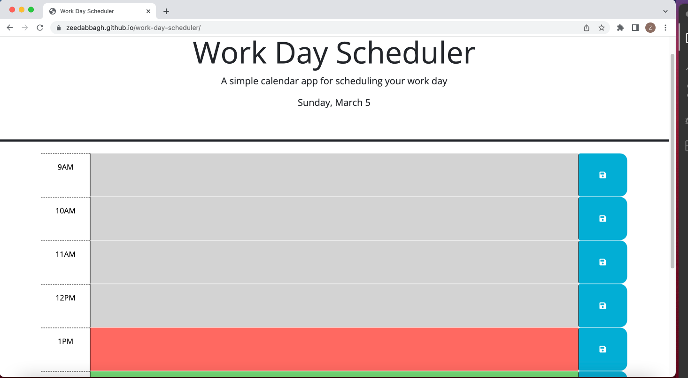

# Third-Party APIs: Workday Scheduler

## Description
```
This is a work-day schedulers for employees with busy schedules, so they can add important events to their daily planners and manage their time effectively
```
## Installation
```
N/A
```
## Usage
```
Add your events to the corresponding time block and click the save button. Your events will remain on the page even if you accidentally refresh or close the page. The color coding indicates past (grey), present(red) and future (green) hours.
```

## Credits
```
```
## License
```
Please refer to the LICENSE in the repo.
```
## Screenshot

## Link to Deployed Web App
https://zeedabbagh.github.io/work-day-scheduler/

